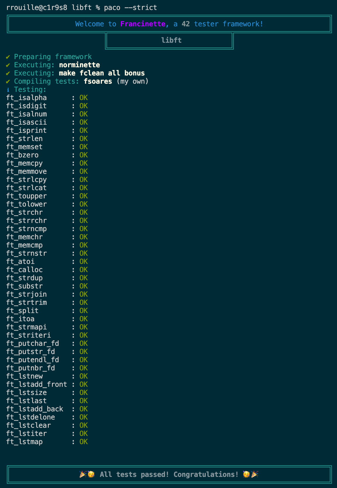

# 42-libft
<p align="center">Very first project in 42 school. Libft consists in coding your own C standard library functions.</p>

<p align="center">
	
	
	
</p>

<div align="center" style="text-align:center">
	
</div>

# 💡 About the project

> _This exercise allows to consolidate the knowledge of the C pool. Indeed, it consists in recoding a certain number of functions of the standard C library as well as other functions that could be useful later on._

	This project is finished !
	
[francinette](https://github.com/xicodomingues/francinette) is happy even with the strict parameter 🙂



<div align="center" style="text-align:center">
	
</div>

# 🛠️ Usage

## Requirements

The function is written in C language and thus needs the **`gcc` compiler** and some standard **C libraries** to run.

## Instructions

**1. Compiling the library**

### To compile, run :

```shell
$ make
```

### If you are working on a school mac, you can run this command to test further (according that [francinette](https://github.com/xicodomingues/francinette) is installed on the computer)

```shell
$ make test
```

### To clean, run :

```shell
$ make fclean
```

<div align="center" style="text-align:center">
	
</div>

## My libft project evaluation

<div align="center">

|      Passed ?      |   Note  |
|--------------------|:-------:|
| :white_check_mark: | 125/100 |

</div>

<div align="center" style="text-align:center">
	
</div>

## All my 42 cursus projects
To have a look on all my 42 school projects, just [click here](https://github.com/rphlr/42-School). I've list my C piscine modules and all my 42 cursus with some usefuls links too.

<div align="center" style="text-align:center">
	
</div>

## Subjects
__All these subjects are the exclusive property of 42 School.__<br />
Any reproduction, use outside the school context of 42 or without authorization is prohibited and may be treated as copyright infringement.

<div align="center" style="text-align:center">
	
</div>

This module was done by [rphlr](https://rphlr.ch).