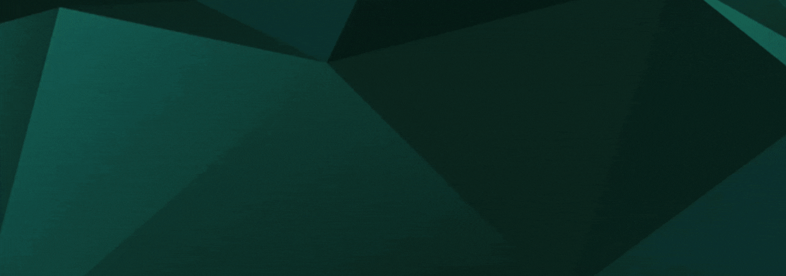
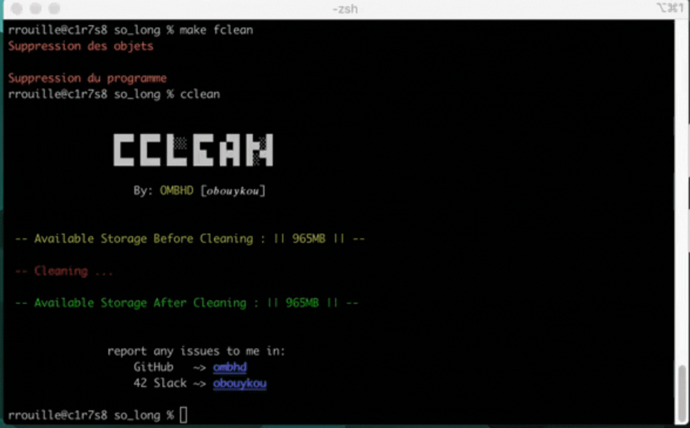
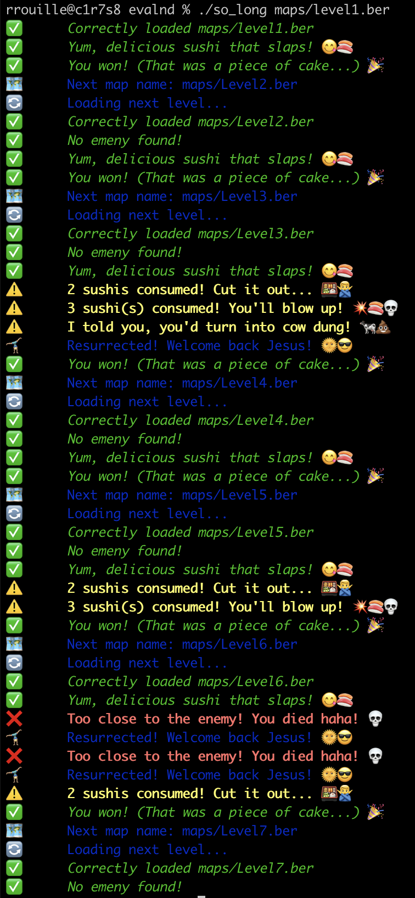
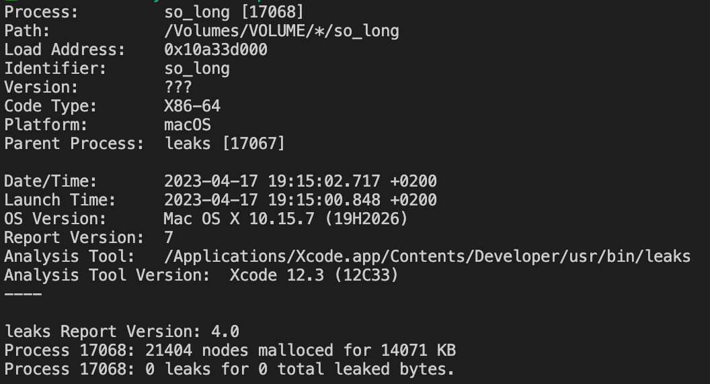

# So_long



## Description

So_long is a design game using the minilibx from the 42 school to make it work. This game is coded in C and is only functional on a mac configured for code as it requires making the project. It works with the arrow keys and R allows to resurrect, while D is a small test implementation that can be used to die. The keys Q or ESC allow to cleanly exit the game.

The goal of the game is to eat all the sushi on the map and then go to the stairs to move on to the next level (or finish if there is no higher level). Be careful not to eat more than 3 sushi because it could explode (he has a small appetite). There may also be a mob, which moves more or less randomly on the map but if it crosses your path, it may well want to kill you... So avoid them. (For now there is only one mob that can be implemented on the map, but maybe I will add a feature to put several, when I have time).

Also be careful, you have to eat all the sushi to move on to the next level, but if there are 4 on the map, you will have to sacrifice a life to explode and come back to life, but after 3 resurrections, it's game over!

## Documentation

The documentation of the project is located in the `docs` folder and it exists in French and English.

## Compilation and Execution

To compile the project, use the command `make` in the terminal at the root of the project. To launch the game, execute the generated `so_long` file with the following command:

```
./so_long maps/<map_name>.ber
```


Make sure to replace `<map_name>` with the name of the map file you want to play. The map file must be in the `.ber` format and parsed as follows:

- `1` for walls
- `0` for floors
- `P` for the player
- `E` for the exit
- `C` for collectibles (i.e. sushi)
- `W` for mobs

If the map is not rectangular or contains an unknown character, the game will not launch. Similarly, if there are no sushi on the map or two players or two exits, the game will not launch. If the path to the exit is not possible, the game will not launch either. All these errors are indicated in the terminal.

To clean the compiled files, you can use the command `make clean`. To remove all compiled files, including the `so_long` executable, use the command `make fclean`.



## Example of Logs



## Leak Control

A leak verification has been performed and the project apparently does not present any leak error. If you see one, you can make a pull request.



## Credits

Project created as part of a project called so_long for 42 school.
